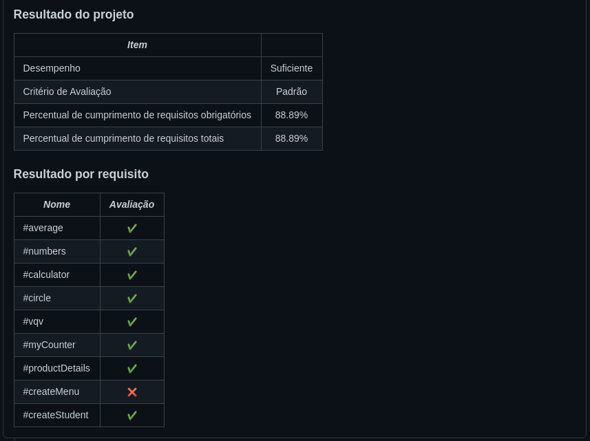

# 🚀️ Projeto realizado no final do bloco 7

## 💚️ Resultado 💚️

---

### Lista de requisitos

### 1 - Implemente a função `average`

A função average recebe um array (tamanho variável) e retorna a média dos valores recebidos. Caso a função receba algum valor não númerico ou um array vazio, o valor undefined deve ser retornado. Todos os resultados devem ser arredondados para valores inteiros. Ex: 4,6 vira 5; 1,3 vira 1. O arquivo `average.spec.js` contém os testes para `average` já implementados. Implemente a função no arquivo `src/average.js` de forma que ela atenda aos testes propostos.  

### 2 - Implemente os casos de teste para a função `numbers`

 A função `numbers` recebe um array (tamanho variável) e retorna true se todos os parâmetros forem do tipo 'number' e false caso contrário. Essa função já está implementada no arquivo `src/numbers.js`. Escreva os testes para essa função para garantir que a implementação de `numbers` está correta.

### 3 - Implemente a função `vqv`

Use template literals para escrever uma função que recebe seu nome e sua idade e retorna o parágrafo descrito abaixo:

```javascript
`'Oi, meu nome é Tunico!
Tenho 30 anos,
trabalho na Trybe e mando muito em programação!
#VQV!'`
```

Caso a função seja chamada sem nenhum parâmetro, o valor undefined deve ser retornado. O arquivo `vqv.spec.js` contém os testes para `vqv` já implementados. Implemente a função no arquivo `src/vqv.js` de forma que ela atenda aos testes propostos.

### 4 - Implemente os casos de teste para a função `circle`

A função `circle` recebe o raio de um círculo e retorna um objeto contendo suas informações (Raio, Área e Circunferência). Se não for especificado um raio, a função retorna `undefined`. Essa função já está implementada no arquivo `src/circle.js`. Escreva os testes para essa função para garantir que a implementação de `circle` está correta.

### 5 - Implemente a função `createStudent`

A função `createStudent` recebe como parâmetro um nome, e retorna um objeto contendo duas chaves:
    (1) name, contendo o nome passado como parâmetro;
    (2) feedback, contendo uma função que retorna a frase 'Eita pessoa boa!' ao ser chamada.
O arquivo `createStudent.spec.js` contém os testes para `createStudent` já implementados. Implemente a função no arquivo `src/createStudent.js` de forma que ela atenda aos testes propostos.

### 6 - Implemente os casos de teste para a função `productDetails`

A função `productDetails` recebe duas strings que representam nomes de produtos, e retorna um array contendo dois objetos com os detalhes dos respectivos produtos:

```javascript
productDetails('Alcool gel', 'Máscara') // Retorna:
  [
    {
      name: 'Alcool gel'
      details: {
        productId: 'Alcool gel123'
      }
    },
    {
      name: 'Máscara'
      details: {
        productId: 'Máscara123'
      }
    }
  ]
```

Essa função já está implementada no arquivo `src/productDetails.js`. Escreva os testes para essa função no arquivo `tests/productDetails.js` para garantir que a implementação de `productDetails` está correta.

### 7 - Implemente a função `objCalculator`
Desenvolva um objeto calculator que possui quatro chaves:
  - add;
  - mult;
  - div;
  - sub.

Para cada uma delas atribua uma função que realiza a respectiva operação. A função deve receber dois inteiros e retornar um inteiro. Os resultados das divisões devem sempre ser arredondados para baixo. O arquivo `objCalculator.spec.js` contém os testes para `objCalculator` já implementados. Implemente a função no arquivo `src/objCalculator.js` de forma que ela atenda aos testes propostos.

### 8 - Implemente a função `myCounter`
A função myCounter possui dois loops aninhados que inserem valores dentro de um array. Como podemos perceber, eles vão adicionando valores ao array até sua condição de parada. Corrija a função `myCounter` para que a função retorne o array correto. O arquivo `myCounter.spec.js` contém os testes para `myCounter` já implementados. Implemente a função no arquivo `src/myCounter.js` de forma que ela atenda aos testes propostos. 

### 9 - Implemente os casos de teste e a função `createMenu`

**Agora prepare-se! Esse último requisito vai te guiar através de um longo e rico processo de desenvolvimento orientado a testes (Test Driven Development, ou TDD). Dará trabalho, mas vale a pena!**

Você é responsável por escrever o código do sistema de pedidos de um restaurante. Deve ser possível, através desse sistema, cadastrar um menu. Dado que um menu foi cadastrado, o sistema deve disponibilizar um objeto através do qual se consegue:
  - ler o menu cadastrado;
  - fazer pedidos;
  - verificar o que foi pedido;
  - somar o valor da conta.

A estrutura deste código e deste objeto já foi definida e você irá implementá-lo. Você encontrará mais detalhes sobre a estrutura a ser seguida e exemplos do retorno da função no arquivo `src/restaurant.js`. Você deverá seguir o passo-a-passo a seguir para garantir o bom desenvolvimento do sistema.

  1. No arquivo `tests/restaurant.spec.js`, escreva um teste que verifica se a função `createMenu()`, retorna um objeto que possui, mas não é necessariamente é limitado à chave `fetchMenu`, a qual tem como valor uma função.
  2. No arquivo `tests/restaurant.spec.js`, escreva um teste que verifica se, dado que a função `createMenu` foi chamada com o objeto: `{ food: {}, drink: {} }`, checa se `'objetoRetornado.fetchMenu()'` retorna um objeto cujas chaves são somente `food` e `drink`.
  3. No arquivo `tests/restaurant.spec.js`, escreva um teste que verifica se o menu passado pra função `createMenu` é identico ao menu recuperado pela função `'objetoRetornado.fetchMenu()'`.
  4. No arquivo `src/restaurant.js`, crie uma função `createMenu()` que, dado um objeto passado por parâmetro, retorna um objeto com o seguinte formato: `{ fetchMenu: () => objetoPassadoPorParametro }`.
  5. No arquivo `tests/restaurant.spec.js`, escreva um teste que verifica se `'objetoRetornado.consumption'`, após a criação do menu, retorna um array vazio.
  6. No arquivo `src/restaurant.js`, adicione ao objeto retornado por `createMenu` uma chave `consumption` que, como valor inicial, tem um array vazio.
  7. No arquivo `tests/restaurant.spec.js`, escreva um teste que verifica se ao chamar uma função associada à chave `order` no objeto retornado, passando uma string como parâmetro, como `objetoRetornado.order('coxinha')`, tal string é adicionada ao array retornado em `objetoRetornado.consumption`
  8. No arquivo `src/restaurant.js`, crie uma função, separada da função `createMenu()`, que, dada uma string recebida por parâmetro, adiciona essa string ao array de `objetoRetornado.consumption`. Adicione essa função à chave `order`.
  9. No arquivo `tests/restaurant.spec.js`, escreva um teste que verifica se as três orders seguintes, de bebidas e comidas mescladas, somam três itens no array `objetoRetornado.consumption` conforme os itens pedidos.
  10. No arquivo `tests/restaurant.spec.js`, escreva um teste que verifica se a função `order` aceita que pedidos repetidos sejam acrescidos a consumption.
  11. No arquivo `tests/restaurant.spec.js`, escreva um teste que verifica que, ao chamar `objetoRetornado.pay()`, retorna-se a soma dos preços de tudo que foi pedido, conforme registrado em `objetoRetornado.consumption`.
  12. No arquivo `src/restaurant.js`, adicione ao objeto retornado por `createMenu()` uma chave `pay` com uma função que varre todo os itens de `objetoRetornado.consumption`, soma o preço de todos checando-os no menu e retorna o valor somado acrescido de 10%. DICA: para isso, você precisará varrer tanto o objeto da chave `food` quanto o objeto da chave `drink`.

---